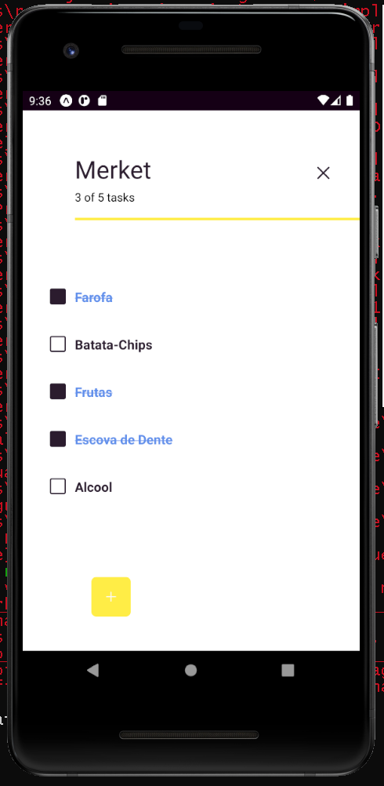

 <h1 align="center">Task-It</h1>
 
🟥🟨🟦

 #Simples e estiloso um aplicativo para gerenciar suas tarefas diárias e manter tudo guardado na caxola as coisas mais importantes que sua Mãe pediu antes de voltar para casa. Desenvolvido para dar foco nas coisas importantes da sua vida! S2 

 <a href="#prototipo">Protótipo</a> •
 <a href="#tecnologias">Tecnologias</a> • 
 <a href="#autor">Autor</a>

<h1 href="#prototipo" align="center">🧪 PROTOTYPE</h1>

[pt_BR]*Protótipo planejado antes da programação do aplicativo, para UI foi utilizado Figma & XD.*

[en_US]*Prototype made in F!gma and XD just for Pre-Features to start code.*

---

<h1 href="#tecnologias" align="center">🚀 TECNOLOGIAS</h1>

*Um Software criado em React-Native & .Expo para gerenciar funções nativas dos próprios sistemas operacionas dos smartphones: Android/iOS, agilizando o processo de criação e gerando módulos externos através do código .Js para transpilar funções de usuário. Para o auxilio de atividades do UX e evitar instalar bibliotecas a programação foi toda feita junto a plataforma Expo que contém package's já por default do próprio React-Native e na facilitação da construição dos arquivos executáveis de ambos dispositivos.*

---

    `v 0.0.9`

**

### Tasks

- [x] O usuário pode ver um campo `input` onde ele pode digitar um item de tarefa;
- [x] Pressionando `enter` (ou um botão), o usuário pode enviar o item de pendências e pode ver que está sendo adicionado a uma lista de pendências;
- [x] O usuário pode marcar uma tarefa como `concluída`;
- [x] O usuário pode remover uma tarefa deslizando para o lado;

### +++

- [] O usuário pode editar uma tarefa;
- [x] O usuário pode ver uma lista com todas as tarefas concluídas;
- [x] O usuário pode ver uma lista com todas as tarefas ativas;
- [] O usuário pode ver a data em que criou a tarefa;
- [] Ao fechar o aplicativo, as tarefas serão armazenadas e quando o usuário retornar, os dados serão recuperados;

<h1 align="center">

</h1>

---

    `v 0.0.6`

**

### Tasks

- [x] O usuário pode ver um campo `input` onde ele pode digitar um item de tarefa;
- [x] Pressionando `enter` (ou um botão), o usuário pode enviar o item de pendências e pode ver que está sendo adicionado a uma lista de pendências;
- [x] O usuário pode marcar uma tarefa como `concluída`;
- [x] O usuário pode remover um item de tarefa pressionando um botão (ou no próprio item de tarefa);

### +++

- [] O usuário pode editar uma tarefa;
- [x] O usuário pode ver uma lista com todas as tarefas concluídas;
- [x] O usuário pode ver uma lista com todas as tarefas ativas;
- [x] O usuário pode ver a data em que criou a tarefa;
- [x] Ao fechar o aplicativo, as tarefas serão armazenadas e quando o usuário retornar, os dados serão recuperados;

<h1 align="center">

</h1>

---

    `v 0.0.3`

*Nesta versão o aplicativo estava com funções de criação de categorias, listas e estilização.*

### Tasks

- [x] O usuário pode ver um campo `input` onde ele pode digitar um item de tarefa;
- [] Pressionando `enter` (ou um botão), o usuário pode enviar o item de pendências e pode ver que está sendo adicionado a uma lista de pendências;
- [] O usuário pode marcar uma tarefa como `concluída`;
- [] O usuário pode remover um item de tarefa pressionando um botão (ou no próprio item de tarefa);

### +++

- [] O usuário pode editar uma tarefa;
- [x] O usuário pode ver uma lista com todas as tarefas concluídas;
- [x] O usuário pode ver uma lista com todas as tarefas ativas;
- [] O usuário pode ver a data em que criou a tarefa;
- [] Ao fechar o aplicativo, as tarefas serão armazenadas e quando o usuário retornar, os dados serão recuperados;

<h1 align="center"></h1>

---

    `v 0.0.0`

Bootstrapts and main quests

### Tasks

- [] O usuário pode ver um campo `input` onde ele pode digitar um item de tarefa
- [] Pressionando `enter` (ou um botão), o usuário pode enviar o item de pendências e pode ver que está sendo adicionado a uma lista de pendências
- [] O usuário pode marcar uma tarefa como `concluída`
- [] O usuário pode remover um item de tarefa pressionando um botão (ou no próprio item de tarefa)

### +++

- [] O usuário pode editar uma tarefa
- [] O usuário pode ver uma lista com todas as tarefas concluídas
- [] O usuário pode ver uma lista com todas as tarefas ativas
- [] O usuário pode ver a data em que criou a tarefa
- [] Ao fechar a janela do navegador, as tarefas serão armazenadas e quando o usuário retornar, os dados serão recuperados

<h1 align="center"> </h1>

---

<h1 href="#author" align="center">📌 AUTHOR</h1>

*...*

### Important

-   [ ] MySQL 5.7.x
-   [ ] React-Native
-   [ ] Compilar aquivo IPA para o Testflight iOS
-   [ ] Compilar arquivo APK para teste no Android

### Tasks

- [x] O usuário pode ver um campo `input` onde ele pode digitar um item de tarefa;
- [x] Pressionando `enter` (ou um botão), o usuário pode enviar o item de pendências e pode ver que está sendo adicionado a uma lista de pendências;
- [x] O usuário pode marcar uma tarefa como `concluída`;
- [x] O usuário pode remover um item de tarefa pressionando um botão (ou no próprio item de tarefa);

### +++

- [] O usuário pode editar uma tarefa;
- [x] O usuário pode ver uma lista com todas as tarefas concluídas;
- [x] O usuário pode ver uma lista com todas as tarefas ativas;
- [x] O usuário pode ver a data em que criou a tarefa;
- [x] Ao fechar o aplicativo, as tarefas serão armazenadas e quando o usuário retornar, os dados serão recuperados;

<h2 align="center">PRODUTO FINAL<h2>

<h1 align="center">
 
</h1>

---

<h1 align="center">🍕</h1>